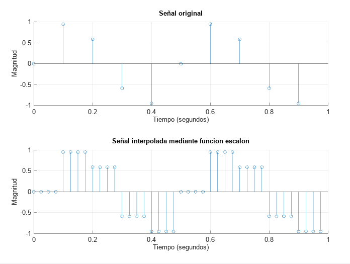

### Ejercicio 1

Escriba funciones que permitan generar las siguientes señales discretas:
1. senoidal.
2. sync.
3. onda cuadrada.
 

Código para generar la onda cuadrada:

```matlab
function [t, y] = cuadrada(tInicial, tFinal, fMuestreo, fSenial, amplitud, angFase)
% te la debo
    
    T = 1 / fMuestreo;
    t = tInicial : T : (tFinal - T);
    y = zeros(1,length(t));
    
    for k=1:length(t)
      if mod(2*pi*fSenial*t(k), 2*pi) >= pi 
        y(k) = -amplitud;
      else  
        y(k) = amplitud;
      end
    end
end
```

### Ejercicio 2
Realizar las siguientes operaciones básicas sobre una señal senoidal:
1. Inversión.
2. Rectificación.
3. Cuantización de 8 niveles.


Código para realizar la cuantización:

```matlab
function yCuantizada = cuantizacion(x, N , H)
% ENTRADA
% x : señal de entrada
% N : numero de niveles de cuantizacion
% H : magnitud del cuanto o paso
    
minX = min(x);
senialPositiva = x - minX;
    
for k=1 : length(senialPositiva)
  if senialPositiva(k) >= 0 && senialPositiva(k) < (N-1)*H,
    senialPositiva(k) = H*round(senialPositiva(k)/H);
  else  % if x >= N*H 
    senialPositiva(k) = (N-1)*H;
  end
    
end
    
yCuantizada = senialPositiva + minX;
```

### Ejercicio 3
Dada la señal de la figura determinar:
1. Amplitud
2. Fase
3. Frecuencia de la señal.
4. Período de muestreo.


Encontramos que la amplitud es igual a 3, vemos que hay dos períodos/ciclos de la señal en 0.1 segundos, por lo tanto $T = 0.1/2$, luego $f_s=2/0.1=20Hz$.
La frecuencia de muestreo podemos determinarla viendo que entre $t=0.01$ y   $t= 0.03$ hay 16 muestras, por lo tanto hay una muestra cada 0.00125 segundos, esto es $f_m=1/0.00125[s]=800Hz$.
La fase ($\phi$) podemos determinarla usando $\phi=-2\pi f_s t_1 = -\pi/4$. 


### Ejercicio 4


#### Gráfica 1 - Muestreo a 100 Hz


La cantidad de ciclos que se puede observar se corresponde con la frecuencia de la señal.

#### Gráfica 2 - Muestreo a 25 Hz


La cantidad de ciclos observados coincide con la frecuencia de la señal, pero la forma de la misma ya se pierde.

#### Gráfica 3 - Muestreo a 10 Hz


En esta gráfica puede verse que cada muestra fue tomada donde la señal original se anula, por lo que se obtiene una señal con valores nulos.

#### Gráfica 4 - Muestreo a 4 Hz


En esta gráfica, si bien el muestreo devuelve una señal con valores no nulos, la cantidad de muestras es tan pequeña que ya no es posible llegar a una conclusión correcta sobre la señal original. No se preserva ni la forma de la onda ni la cantidad de ciclos.

#### Gráfica 5 - Muestreo a 1 Hz


Este muestreo cuenta de una sola muestra. No sirve para nada.

#### Gráfica 6 - Muestreo a 0,5 Hz


Por la manera en que se realiza el muestreo, en este caso no se alcanza a tomar ni siquiera una muestra de la señal.

```matlab
T = 1 / fMuestreo;
t = tInicial : T : (tFinal - T);
```

Para este caso, $T = 1/0,5 \, Hz = 2 \, s$. Puede verse que el extremo final del intervalo va a ser $tFinal - T = 1 \, s - 2 \, s = -1 \, s$, que es menor al extremo inferior del intervalo, por lo que dicho vector va a estar vacío.

### Ejercicio 5


La frecuencia observada del resultado es de $1 Hz$, y no de $4000 Hz$, como tiene la onda original.

Esto era de esperarse, porque lo planteado no cumple el teorema del muestreo, es decir, que no se cumple $2f_s \le f_m$.

El efecto observado se denomina *aliasing*, y ocurre porque, para la frecuencia de muestreo utilizada, una sinusoide de $4000 Hz$ produce las mismas muestras que una de $1 Hz$.

Por ejemplo:


En general, cuando una sinusoide de frecuencia $f_s$ es muestreada con frecuencia $f_m$, el número resultante de ciclos por muestra es $f_s / f_m$ (conocido como *frecuencia normalizada*), y las muestras son indistinguibles de aquellas de otra sinusoide (llamada *alias*) cuya frecuencia normalizada difiere por un entero (positivo o negativo).

En este caso,

$$
\begin{align}
& f_{N_1} = f_{s_1} / f_m = \frac{4000 Hz}{129 Hz} = 31,0078 \\
& f_{N_2} = f_{s_2} / f_m = \frac{1 Hz}{129 Hz} = 0,0078 \\
& f_{N_1} - f_{N_2} = 31
\end{align}
$$

### Ejercicio 6
Genere una señal discreta con frecuencia de muestreo de 10 Hz y sobremuestreela, mediante distintos tipos de interpoladores, a 4 veces la frecuencia de muestreo. Para esto, implemente la siguiente ecuación de interpolación:


1. **Escalon**


2. **Lineal**


3. **Sinc**


Código para interpolar una señal:

```matlab
function [tInterpolado, yInterpolado] = interpolar(tOriginal, yOriginal, tipoInterpolador, factorRemuestreo)
    
T = tOriginal(2) - tOriginal(1);
nuevoT = T / factorRemuestreo;
    
% Generar el nuevo vector de tiempo
tInterpolado = tOriginal(1) : nuevoT : (tOriginal(end) + (factorRemuestreo - 1) * nuevoT);
% Generar el nuevo vector de valores
yInterpolado = zeros(1, length(tInterpolado));
    
% para una muestra de la señal interpolada
for ii = 1 : length(tInterpolado);
    
% iterar sobre todas las muestras de la senial original
    
  % para cada muestra de la senial original
  for jj = 1 : length(tOriginal)
    % se multiplica esa muestra por la funcion interpolante evaluada
    
    % Se reduce la precision del resultado de la division porque, cuando
    % se dividen dos numeros practicamente iguales, puede que el resultado de
    % menor a 1 por cosas raras de los numeros flotantes.
    % Reduciendo la precision, se obtiene el comportamiento deseado, es decir,
    % que al dividir dos cosas casi iguales se obtenga 1 (de nuevo, por cosas
    % raras de los numeros flotantes.
    argInterpolante = single((tInterpolado(ii) - tOriginal(jj)) / T);
    
%    funcionInterpolante = @tipoInterpolador;
    contribucion = yOriginal(jj) * feval(tipoInterpolador, argInterpolante);
    % se acumulua
    yInterpolado(ii) += contribucion;
    
  % el valor de la muestra interpolada es igual a lo acumulado entre todas
  % las muestras originales
  end
% fin iteracion
end
```

Código para la función interpolante lineal:

```matlab
function y = interpolanteLineal (x)
    
if (abs(x) < 1)
  y = 1 - abs(x);
else
  y = 0;
end
```
