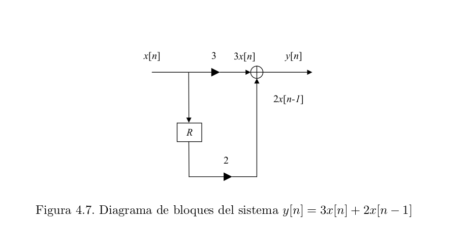

1. ¿Qué formas pueden tomar las reglas de comportamiento de un sistema? Ejemplifique.

	Para los propósitos de este ejercicio nos vamos a limitar a los sistemas LTI discretos.
    Las reglas de comportamiento de un sistema pueden darse de varias maneras:
    a. Una ecuación en diferencias con coeficientes constantes.
    La ecuación en diferencias de un sistema LTI tiene la forma
$$
\sum_{k=0}^{N} a_k y[n-k] = \sum_{k=0}^{M} b_k x[n-k]
$$
    Esta ecuación puede acomodarse de la siguiente forma:
$$
y[n] = \frac{1}{a_0} \left( \sum_{k=0}^{M} b_k x[n-k] - \sum_{k=1}^{N} a_k y[n-k] \right)
$$
    Esta última forma expresa la salida del sistema en términos de la entrada actual de la entrada y en valores anteriores de la entrada y la salida.
b. Un diagrama en bloques.
    Constituye una forma gráfica de ver un sistema definido mediante las ecuaciones anteriores.
    Ejemplo:

2. ¿Qué relación conceptual existe entre las ecuaciones diferenciales y las ecuaciones en diferencia?

    Ambos tipos de ecuaciones se utilizan para describir sistemas, solo que las primeras se utilizan para sistemas de tiempo continuo y las segundas para sistemas de tiempo discreto.

3. ¿Todos los sistemas MA son FIR? Justifique.

	Si. Como los sistemas MA son promedios móviles de elementos de la entrada, esto garantiza que la salida se va a anular cuando se agote la entrada.

4. ¿Todos los sistemas AR son IIR? Justifique.

	No se. En el libro de Oppenheim pág. 123 (pág. 151 del pdf) dice que *por lo general* este tipo de sistemas son IIR. Pero no menciona ejemplos donde esto no ocurra.

5. ¿Todos los sistemas ARMA son IIR? Justifique.

	Depende del punto anterior me parece.