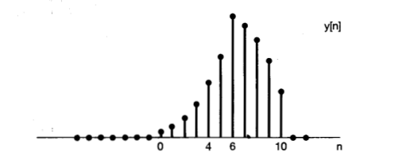

% Preguntas convolución

1. Demuestre las siguientes propiedades de la convolución lineal de dos señales continuas:

    - Si $y(t) = x(t) * h(t)$ entonces $Y(w) = X(w) Y(w)$.
    - Si $y(t) = x(t) h(t)$ entonces $Y(w) = X(w) * Y(w)$.

    Donde $Y(w)$, $X(w)$ y $H(w)$ son las transformadas de Fourier de $y(t)$, $x(t)$ y $h(t)$ respectivamente.

    **Demostración de la primer propiedad**

    $$
    \begin{align}
    \mathcal{F} \{x(t) * y(t)\} & = \int_{-\infty}^{\infty} \left[ x(t) * y(t) \right] \, e^{-j \omega t} dt = \\
    & = \int_{-\infty}^{\infty} \left[ \int_{-\infty}^{\infty} x(\tau) y(t - \tau) d\tau \right] e^{-j \omega t} dt = \\
    & = \int_{-\infty}^{\infty} x(\tau) \left[ \int_{-\infty}^{\infty} y(t - \tau) \, e^{-j \omega t} dt \right] d\tau = \\
    & = \int_{-\infty}^{\infty} x(\tau) \left[ \int_{-\infty}^{\infty} y(t - \tau) \, e^{-j \omega t} \, e^{j\omega\tau} \, e^{-j\omega\tau} dt \right] d\tau = \\
    & = \int_{-\infty}^{\infty} x(\tau) e^{-j \omega \tau} \left[ \int_{-\infty}^{\infty} y(t - \tau) \, e^{-j \omega (t - \tau)} d(t) \right] d\tau = \\
    & = \int_{-\infty}^{\infty} x(\tau) e^{-j \omega \tau} \left[ \int_{-\infty}^{\infty} y(t - \tau) \, e^{-j \omega (t - \tau)} d(t - \tau) \right] d\tau = \\
    & = \int_{-\infty}^{\infty} x(\tau) \, Y(\omega) \, e^{-j \omega \tau} d\tau = \\
    & = Y(\omega) \int_{-\infty}^{\infty} x(\tau) \, e^{-j \omega \tau} d\tau = \\
    & = X(\omega) \, Y(\omega)
    \end{align}
    $$

    **Demostración de la segunda propiedad**

    $$
    \begin{align}
    \mathcal{F} \{x(t) \, y(t)\} & = \int_{-\infty}^{\infty}
                                        x(t) \, y(t) \, e^{-j \omega t}
                                    dt = \\
    & = \int_{-\infty}^{\infty}
            \left[
                \frac{1}{2 \pi} \int_{-\infty}^{\infty} X(\omega') \, e^{j \omega' t} d\omega'
            \right]
            y(t) \, e^{-j \omega t}
        dt = \\
    & = \frac{1}{2\pi}
        \int_{-\infty}^{\infty}
            X(\omega')
            \left[ \int_{-\infty}^{\infty}
                y(t) \, e^{j\omega't} \, e^{-j\omega t}
            dt \right]
        d\omega' = \\
    & = \frac{1}{2\pi}
        \int_{-\infty}^{\infty}
            X(\omega')
            \left[ \int_{-\infty}^{\infty}
                y(t) \, e^{-j(\omega - \omega')t}
            dt \right]
        d\omega' = \\
    & = \frac{1}{2\pi}
        \int_{-\infty}^{\infty}
            X(\omega') \, Y(\omega - \omega') \,
        d\omega' = \\
    & = X(\omega) * Y(\omega)
    \end{align}
    $$

2. Suponga que un sistema posee una respuesta impulsional $h[n]$ que varía el el tiempo de acuerdo a una ley conocida. Considerando esto, ¿es posible encontrar la salida del sistema mediante la convolución lineal de la entrada $x[n]$ con $h[n]$? Proponga un ejemplo para responder la pregunta.

    **Respuesta**

    Considere una entrada $x[n]$ y una respuesta al impulso unitario $h[n]$ dadas por

    $$
    \begin{align}
        x[n] & =
        \begin{cases}
            1, & 0 \le n \le 4 \\
            0, & \text{con otro valor}
        \end{cases} \\
        h[n] & =
        \begin{cases}
            a^n, & 0 \le n \le 6 \\
            0, & \text{con otro valor}
        \end{cases}
    \end{align}
    $$

    Para calcular la convolución de las dos señales, resulta conveniente considerar 5 intervalos separados para $n$.

    **Intervalo 1**. Para $n < 0$, no hay hay traslape entre las porciones diferentes de cero de $x[k]$ y $h[n - k]$, y en consecuencia, $y[n] = 0$.

    **Intervalo 2**. Para $0 \le n \le 4$,

    $$
    x[k]h[n-k] =
    \begin{cases}
        a^{n-k}, & 0 \le k \le n \\
        0, & \text{con otro valor}
    \end{cases}
    $$

    Así, en este intervalo,

    $$
    y[n] = \sum_{k = 0}^{n} a^{n-k}
    $$

    Se puede evaluar esta suma mediante el uso de la fórmula de suma finita. Específicamente, cambiando la variable de la sumatoria en la ecuación anterior de $k$ a $r = n-k$, se obtiene

    $$
    y[n] = \sum_{k=0}^{n} a^r = \frac{1-a^{n+1}}{1-a}
    $$

    **Intervalo 3**. Para $n > 4$ pero $n-6 \le 0$ (es decir, $4 < n \le 6$),

    $$
    x[k]h[n-k] =
    \begin{cases}
        a^{n-k}, & 0 \le k \le 4 \\
        0, & \text{con otro valor}
    \end{cases}
    $$

    Así, en este intervalo,

    $$
    y[n] = \sum_{k=0}^{4} a^{n-k}
    $$

    Separando el factor constante $a^n$ de la sumatoria, se obtiene

    $$
    y[n] = a^n \sum_{k=0}^{4} \left( a^{-1} \right)^k =
            a^n \frac{1 - \left( a^{-1} \right)^5}{1 - a^{-1}} =
            \frac{a^{n-4} - a^n+1}{1 - a}
    $$

    **Intervalo 4**. Para $n > 6$ pero $n-6 \le 4$ (es decir, para $6 < n \le 10$),

    $$
    x[k]h[n-k] =
    \begin{cases}
        a^{n-k}, & (n-6) \le k \le 4 \\
        0, & \text{con otro valor}
    \end{cases}
    $$

    de manera que

    $$
    y[n] = \sum_{k=n-6}^{4} a^{n-k}
    $$

    Haciendo que $r = k-n+6$, se obtiene

    $$
    y[n] = \sum_{r = 0}^{10-n} a^{6-r} =
            a^6 \sum_{r=0}^{10-n} \left( a^{-1} \right)^r =
            a^6 \frac{1 - a^{n-11}}{1 - a^{-1}} =
            \frac{a^{n-4} - a^7}{1 - a}
    $$

    **Intervalo 5**. Para $n-6 > 4$, o de manera equivalente, $n > 10$, no hay traslape entre las porciones diferentes de cero de $x[k]$ y $h[n-k]$, y por consiguiente

    $$
    y[n] = 0
    $$

    **Resumiendo**, se obtuvo

    $$
    y[n] =
    \begin{cases}
        0, & n < 0 \\
        \frac{1 - a^{n+1}}{1-a}, & 0 \le n \le 4 \\
        \frac{a^{n-4} - a^n+1}{1 - a}, & 4 < n \le 6 \\
        \frac{a^{n-4} - a^7}{1 - a}, & 6 < n \le 10 \\
        0, & 10 < n
    \end{cases}
    $$

    El resultado puede verse en la siguiente figura.

    
