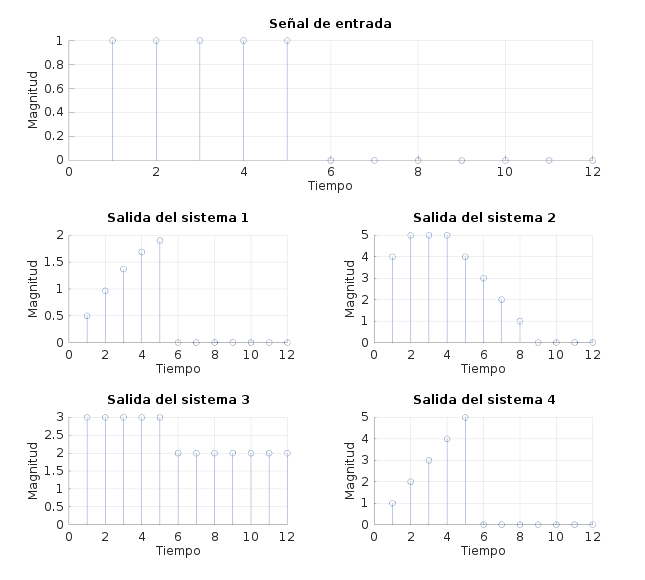

# Sistemas

# Ejercicio 1

* Causal: Si
* Lineal:
    * Homogéneo: Si.
    * Superposición: Si PREGUNTAR
* Invariante en el tiempo: No por la componente senoidal.
* Memoria: No posee.

* Causal: No.
* Lineal:
    * Homogéneo: Si.
    * Superposición: Si.
* Invariante en el tiempo: Si.
* Memoria: Posee.

* Causal: Si
* Lineal:
    * Homogéneo: No.
    * Superposición: No
* Invariante en el tiempo: Si
* Memoria: No posee.

* Causal: Si
* Lineal:
    * Homogéneo: Si.
    * Superposición: Si
* Invariante en el tiempo: No
* Memoria: No posee.

### Salida de los sistemas para una entrada escalón unitario

# Convolución

## Ejercicio 3

### Resultado del sistema $(x[n] * h_A) * h_B$:

### Resultado del sistema $(x[n] * h_B) * h_A$:

Como puede verse, la salida de los sistemas es igual.  
Esto sucede porque los dos sistemas son lineales e invariantes en el tiempo.  
Bajo estas condiciones, la convolución de varias secuencias es conmutativa, es decir, el orden en que pase la señal de entrada por los sistemas intermedios es indistinto.