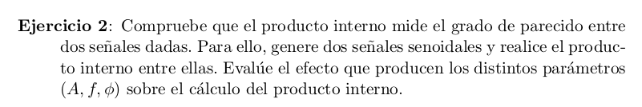
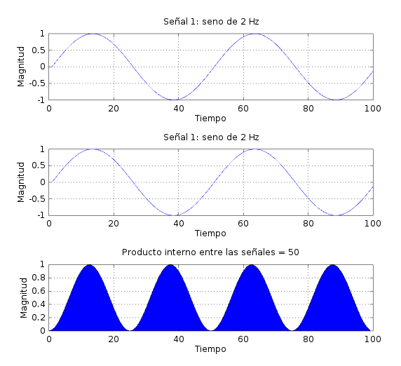
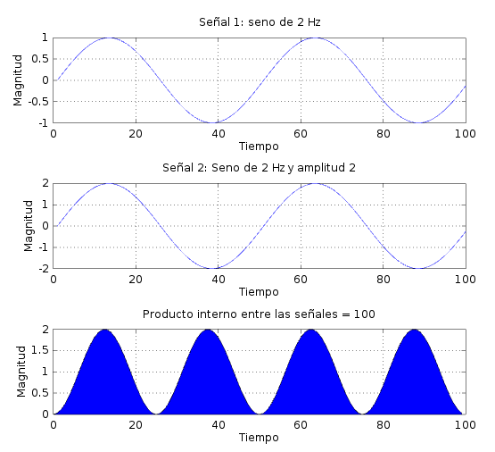
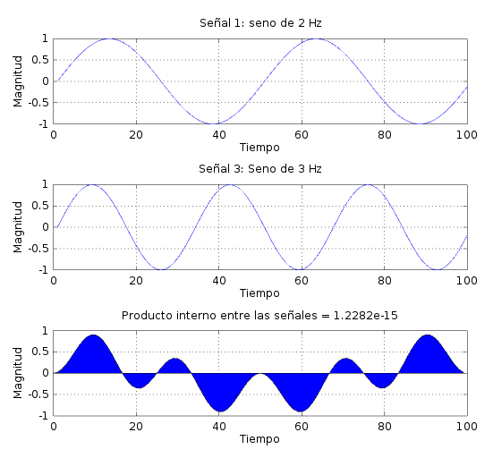
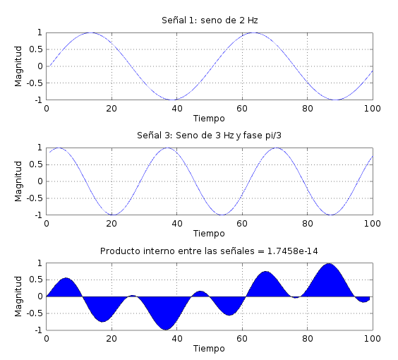
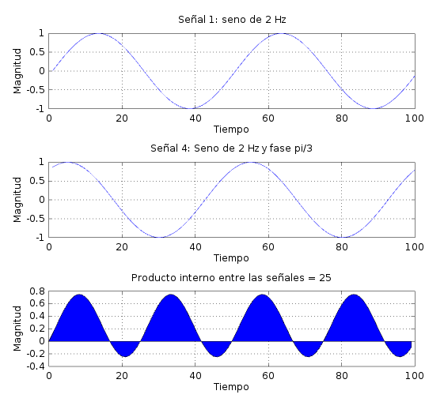
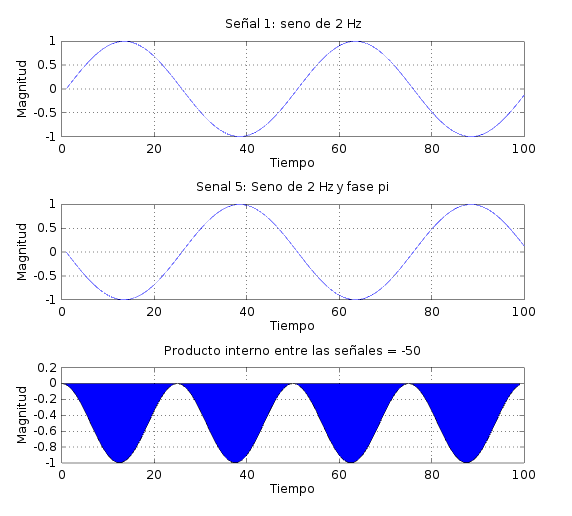

# Guía Práctica 2

#### Ejercicio 2

En primer lugar, se muestra el resultado del producto interno de una señal consigo misma.

Como puede verse, el resultado es positivo, porque el producto elemento a elemento de una señal consigo misma es siempre $\ge 0$.

Producto de una señal con una señal idéntica pero con el doble de amplitud:

En este caso, el resultado de la operación es el doble que lo anterior. Podemos ver que el producto punto es una operación homogénea.

Producto de una señal con otra señal de distinta frecuencia:

En este caso, las señales resultan ortogonales, y el resultado de la operación es 0. Veamos qué pasa cuando a la segunda señal se le cambia la fase:

Puede verse que, cuando las sinusoidales tienen distinta frecuencia, van a ser ortogonales siempre, sin importar la fase entre ellas.

Producto interno de la señal por una de la misma frecuencia pero desfasada en $pi/3$:

Puede verse que el producto elemento a elemento entre las señales produce más contribuciones positivas que negativas (porque el retardo entre las dos señales es relativamente pequeño), por lo tanto si bien el resultado de la operación es menor que el producto interno de la señal original consigo misma, el resultado en este caso sigue siendo positivo.

Producto interno de la señal por uno de la misma frecuencia pero opuesta (fase $pi$):

Como las señales son opuestas, el producto elemento a elemento produce únicamente componentes negativas, y el resultado total es negativo. Puede verse que para señales similares pero opuestas, el resultado en general será negativo.