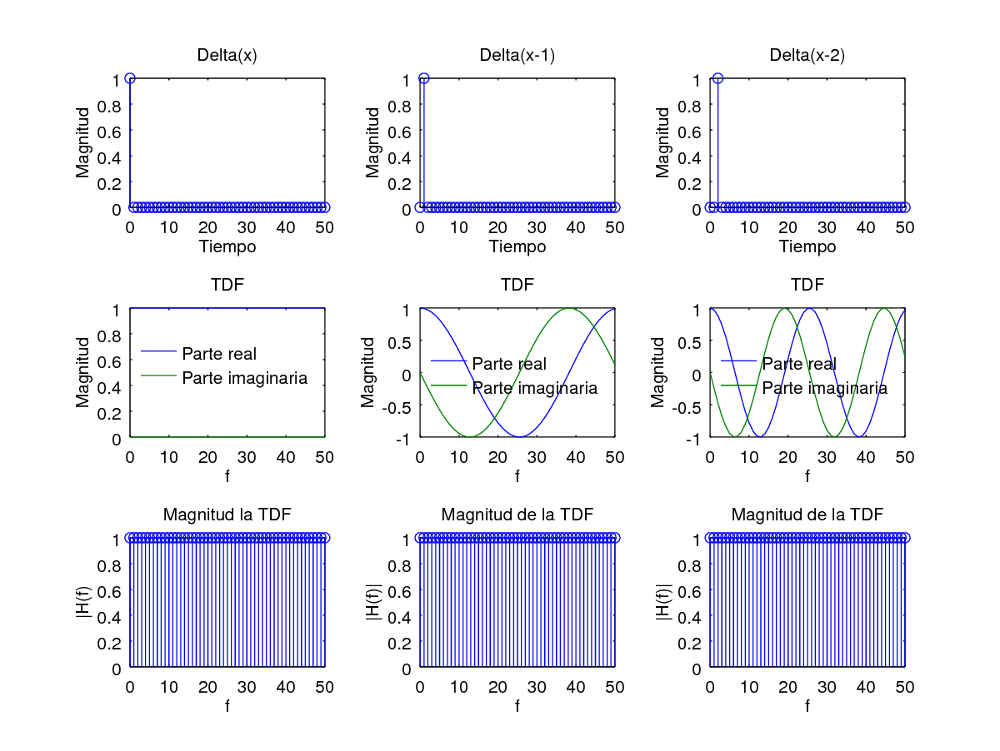
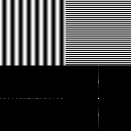

1. ¿Qué unidades tiene la Transformada de Fourier?

    La Transformada de Fourier es una función en frecuencia y toma valores complejos.

    El valor absoluto de la TDF indica la cantidad de esa frecuencia presente en la señal original. El argumento de la parte compleja indica el desplazamiento de fase de esa componente de frecuencia respecto de la parte real de la exponencial (coseno).

2. ¿Es siempre útil realizar el análisis de una señal mediante la Transformada de Fourier?

    TODO Solamente es útil cuando es determinística, y ademas conoces el espectro de frecuencias que necesitas\
por ejemplo tenes un ruido en tal frecuencia, bue haces el análisis de fourier  y lo eliminas\
podes decir también que depende del tipo de señal, hay algunas (como seno, coseno) que tiene mas información en el tiempo que en frecuencia.

3. ¿Se puede utilizar una base que no sea ortogonal para realizar el análisis de una señal? ¿Cuál es la ventaja de la ortogonalidad?

    Se puede utilizar una base que no sea ortogonal para el análisis de una señal, pero la ventaja de la ortogonalidad es que en este caso la descomposición va a ser única, lo que simplifica el análisis. TODO\
Yo diría que si se puede usar pero la ventaja es en el cálculo de los coeficientes de la combinación lineal salen directo del producto punto (proyección) y garantizan el menor error.

4. ¿Existe la Transformada de Fourier de una señal senoidal?

    Si. TODO Tal vez mostrarlo para el caso de una señal senoidal continua.

5. ¿Por qué no se puede analizar cualquier señal con una base constituida sólo por funciones sinusoidales?

    No se puede realizar un análisis frecuencial utilizando una base de funciones sinusoidales ya que, en caso de que la señal analizada tenga sus componentes desfasadas con respecto a las sinusoides de la base, estas componentes frecuenciales no serán detectadas.

    Utilizar una base exponencial resuelve esto, ya que en caso de que una componente de la señal este desfasada respecto a la parte real de una de las exponenciales, en cambio estará en fase con la parte imaginaria de dicha exponencial, por lo que la componente será detectada.

6. ¿Qué relación tiene la propiedad de desplazamiento frecuencial de la TF con la modulación de señales?

    TODO Ver en el audio de clase, ahí lo explica

    Sirve para modular las señales, si tengo una señal y la multiplico por una portadora (exponencial compleja), el espectro se corre una cantidad $F_0$.\
si mira, si vas a la diapositiva donde dice "la familia de Fourier" que es el tema anterior a las propiedades, eso esta en 1:06hs del audio 3

7. ¿Qué inconvenientes aparecen cuando pasamos de las señales analógicas a las digitales?

    TODO.\
El problema es definir una base que sirva para el análisis. Página 82 del libro.

8. ¿Cómo se manifiesta el aliasing en una señal del tiempo desde el punto de vista temporal y frecuencial? ¿Y en una imagen?

    Desde el punto de vista temporal, el aliasing se manifiesta como el defecto en el que un componente de una señal de una cierta frecuencia se muestrea de tal manera que es interpretada como una componente de menor frecuencia, perdiendo información.

    En el caso del sonido, provoca que componentes no deseados del sonido escuchado (aquellos que están por encima de la frecuencia de Nyquist) se traduzcan en un alias en el sonido grabado, distorsionando la muestra.

    Desde el punto de vista frecuencial, esto se ve como un solapamiento de las colas de las TDF (las partes que contienen las frecuencias mas altas), haciendo que la energía de estas colas se acumule en bandas de menor frecuencia.

    En una imagen este efecto se denomina aliasing espacial, y este se manifiesta típicamente como patrones de Moiré.

9. ¿Cómo se pueden disminuir los efectos del aliasing?

    Una de las maneras es simplemente aumentar la frecuencia de muestreo, de manera de muestrear correctamente las componentes de frecuencia altas que, de otro modo, provocaría aliasing. Este método no es muy común, ya que generalmente nos encontramos restringidos por el equipamiento o por otras limitantes en la frecuencia de muestreo que va a ser empleada.

    En el caso típico, los efectos del aliasing se pueden disminuir filtrando las componentes del sonido que tienen una frecuencia más alta que la frecuencia de Nyquist empleada. De esta manera, no existirán componentes de frecuencia que produzcan aliasing.

10. ¿Cuál es el resultado más evidente de muestrear una señal (desde el punto de vista frecuencial)?

    TODO

    ¿Aliasing?

    ¿Periodicidad de la transformada de Fourier de una señal muestreada?

    y yo creo que es la relación inversa entre tiempo y frecuencia\
es decir que lo que se comprime en el tiempo se expande en frecuencia y viceversa\
o sea, por ahí calculo que viene la mano pero no se decirte exactamente\
por el periodo de muestreo

11. ¿Por qué se dice que la función sincrónica constituye el interpolador ideal?

    Pensar en lo que pasa cuando se muestrea una señal. En el dominio temporal, la TDF se hace periódica.

    Si se quiere volver hacia atrás, es necesario quedarse con solo uno de los períodos de la TDF. Para ello, es necesario "recortar" el espectro, aplicando un filtro pasa bajos que tome solo un período de la señal. Este "recorte" se hace utilizando una ventana cuadrada.

    Ahora bien, cuando se multiplica por la ventana cuadrada en el dominio frecuencial, en el dominio temporal ocurre una convolución con la TDF de la ventana, que es la función Sinc. Esta operación reconstruye perfectamente la señal, y además podemos ver que lo que ocurre en el dominio temporal es una interpolación con la función Sinc.

    Como la interpolación con la función Sinc reconstruye perfectamente la señal, se dice que esta función es el interpolador ideal.

    Otra razón por la que se llama ideal es porque no es posible implementarlo en la práctica. En el dominio frecuencial, no es posible tener un filtro cuadrado perfecto (al menos de forma analógica). En el dominio temporal tampoco se puede trabajar con una función Sinc porque es la respuesta al impulso de un sistema no causal. Un sistema no causal es un sistema que responde a un estímulo antes de que el mismo sea aplicado. Esto no existe físicamente. (TODO ver bien qué significa esto último).

12. ¿Cuál es la diferencia entre la Transformada de Fourier de una señal muestreada y la TDF?

    La diferencia entre éstas es que la Transformada de Fourier de una señal muestreada es continua en el dominio frecuencial, aunque presenta los defectos introducidos por el aliasing y por el ventaneo.

13. ¿Qué distorsiones incorpora el uso de ventanas rectangulares en el espectro de las señales resultantes? ¿Cómo puede minimizarse este efecto?

    TODO

    ¿Como se obtienen las gráficas de la página 94?

14. ¿Qué ventajas puede tener plantear a la TDF como un producto de vectores y matrices? ¿Qué significa que una transformación sea unitaria y cómo se logra?

    La ventaja de plantear a la TDF como un producto de vectores y matrices es que, por un lado, simplifica el análisis de encontrar la transformación inversa y, por otro lado, permite utilizar distintas técnicas del álgebra matricial para optimizar los cálculos. TODO

15. ¿Qué diferencia existe entre la TDF y la TRF?

    La velocidad de cálculo. El resultado es el mismo.

16. ¿En qué ideas se basa la TRF para lograr su objetivo?

    Reducir la cantidad de multiplicaciones y sumas empleadas.

    Reconocer que hay términos en la matriz de transformación que, bajo análisis, son iguales, lo que reduce la cantidad de exponenciales complejas calculadas.

    Utilizar factorizaciones que aprovechan la forma de la matriz de transformación para reducir el número de cálculos.

17. ¿Qué es la resolución frecuencial y cómo puedo aumentarla?

    La resolución frecuencial es la mínima separación en frecuencia que debe existir entre distintos componentes de una señal para poder reconocerlos como distintos.

    De acuerdo al principio de incertidumbre de Heisenberg:
$$
\Delta f \Delta t = \frac{1}{N} = \frac{1}{T_0 f_m}
$$
    no sirve aumentar la frecuencia de muestreo. Lo que es necesario es, o bien disminuir $fm$ para un N constante, o bien aumentar N manteniendo fija $fm$.

    Una forma de conseguir esto es ¿remuestreando la señal? ¿Cómo funcionaría la cosa?

    TODO

18. ¿Qué significa relleno de ceros (zero-padding)?

    Es una manera de aumentar la resolución frecuencial de nuestro análisis sin realizar un remuestreo.

    Implica rellenar con ceros en el final de la señal para, de esta manera "prolongar" la duración de la misma, lo que en la ecuación de Heisenberg significa que se aumenta $N$ manteniendo $f_m$, por lo que $\Delta t$ se mantiene constante y $\Delta f$ disminuye, aumentando la resolución frecuencial.

19. Cuando se utiliza la TRF, ¿dónde se guardan las frecuencias negativas?

    ¿Qué son las frecuencias negativas?

    Sintetizar una sinusoide a partir de una sola exponencial compleja no es posible, ya que la segunda tiene una componente imaginaria.

    Para resolver esto, se suman dos exponenciales complejas: la segunda revoluciona a la misma velocidad que la primera, pero en sentido contrario, de manera que sus contribuciones imaginarias se cancelan.

    

    A la exponencial que gira en el sentido de las agujas del reloj, se dice que tiene frecuencia negativa, como se ve en la siguiente fórmula:
$$
cos(\omega t) = \frac{1}{2} \left(e^{j\omega t} + e^{-j\omega t}\right)
$$
    [(Explicación de frecuencias negativas)](http://electronics.stackexchange.com/questions/15539/negative-frequencies-what-is-that/15543#15543)

    Las frecuencias negativas se guardan en la segunda mitad de la TRF (las últimas N/2 componentes). ¿Por qué? ¿Por la periodicidad de la transformada de Fourier? TODO.

20. ¿Qué es la autocorrelación y la correlación cruzada? ¿Para qué sirven?

    La correlación cruzada es una medida de la similaridad de dos series de tiempo en función del retardo de una relativa a la otra. Tiene aplicaciones en reconocimiento de patrones y muchas otras áreas.

    La autocorrelación es la correlación cruzada de una señal consigo misma. Permite encontrar patrones escondidos en la señal, como la presencia de una señal periódica bajo ruido, entre otras cosas.

21. ¿Cómo se puede utilizar la TRF para acelerar el cálculo de la convolución y de la correlación?

    Correlación cruzada: el teorema de la correlación cruzada dice que la transformada de Fourier de la correlación cruzada entre dos secuencias es igual al producto del conjugado de la TRF de la primera por la TRF de la segunda. Haciendo la TFI a este último resultado es posible obtener de manera más óptima la correlación entre las secuencias.

    Convolución: La transformada de Fourier de la convolución circular entre dos secuencias es igual al producto de las transformadas de Fourier de cada secuencia. Las convoluciones comunes pueden ser expresadas en forma de convoluciones circulares, de manera de aprovechar esta propiedad.

22. ¿Cómo se estima el espectro de una señal aleatoria?

    La transformada de Fourier de una señal aleatoria es también aleatoria, por lo que esta herramienta por si sola, no es suficiente para estimar el espectro de la señal.

    Para esto, es necesario utilizar herramientas de estimación de análisis espectral, entre ellas: periodograma, método de Bartlett, método de Welch.

23. ¿Qué es el ruido blanco?

    El ruido blanco es una señal aleatoria con densidad espectral de potencia constante.

    En el tiempo, esto es una señal cuyas muestras son una secuencia de variables aleatorias no correlacionadas con media cero y varianza finita. Dependiendo del contexto, también puede requerirse que las muestras sean independientes y que sigan la misma distribución de probabilidad. Por ejemplo, si cada muestra tiene distribución normal con media cero, se dice que la señal es ruido blanco Gaussiano.

24. ¿Qué diferencias existen entre el espectro de un delta Dirac y un ruido blanco?

    La definición del delta de Dirac es
$$
\int_{-\infty}^\infty \delta (x) \, f(x) \, dx = f(0)
$$
    La propiedad de desplazamiento del delta de Dirac dice que
$$
\int_{-\infty}^\infty \delta (x - a) \, f(x) \, dx = f(a)
$$
    La transformada de Fourier de un delta de Dirac puede calcularse fácilmente a partir de la definición:
$$
\mathcal{F} \lbrace \delta (x) \rbrace (u) = \int_{- \infty}^\infty \delta (x) \, \exp (-i 2 \pi u x) \, dx = \exp(0) = 1
$$
    y, por la propiedad de desplazamiento, se tiene que
$$
\mathcal{F} \lbrace \delta (x-a) \rbrace (u) = \exp(-i 2 \pi au)
$$
    que es una exponencial compleja de frecuencia negativa con valor $a$.

    Notar que la magnitud del delta de Dirac desplazado sigue siendo 1:
$$
|\mathcal{F} \lbrace \delta (x-a) \rbrace (u)|^2 = |\exp(-i 2 \pi au)|^2 = 1
$$
    

25. ¿Cómo construiría un analizador de respuesta en frecuencia mediante un osciloscopio y oscilador controlado por tensión?

    Los osciloscopios cuentan con un modo de funcionamiento, el modo XY, en el que se realiza un análisis comparativo de dos señales de entrada. En particular, cuando las señales de entrada son señales armónicas, este análisis produce en pantalla un tipo de figura especial denominado [curva de Lissajous](https://es.wikipedia.org/wiki/Curva_de_Lissajous).

    Para el analizador de frecuencia se utilizará la salida del oscilador como una de las entradas al osciloscopio, y la señal a analizar será la otra entrada. Se asume que la señal de análisis está compuesta por sinusoidales. TODO ¿No está siempre compuesta por sinusoidales? (Si toda señal periódica puede descomponerse en término de sinusoidales).

    En particular, cuando las dos señales de entrada poseen la misma frecuencia, la curva de Lissajous tiene la forma general de elipse, con los casos especiales de círculo o línea recta, dependiendo de la fase que exista entre las mismas. Por lo tanto, para saber si la señal posee una componente en una determinada frecuencia, se genera dicha frecuencia con el oscilador, y se verifica si el patrón mostrado en pantalla es una elipse, círculo o línea recta.

    Luego, para estimar la magnitud de esta componente de señal, se tiene en cuenta la relación $\frac{A}{B}$ entre la amplitud A de la onda generada por el osciloscopio y la amplitud B de la componente de la señal analizada. Esta relación determina la relación ancho:alto de la figura de Lissajous, que será A:B. Estimando esta relación, es posible estimar el valor de amplitud B de la componente de la señal analizada.

26. ¿Y con un banco de filtros?

    TODO

27. ¿Por qué decimos que la cóclea realiza un análisis espectral?

    Se dice que la cóclea realiza un análisis espectral debido a que diferentes secciones de la misma reaccionan a diferentes componentes de frecuencia del sonido. Estas reacciones son codificadas en impulsos nerviosos que son luego interpretados por el cerebro.

    Una consecuencia de esta manera de percibir el sonido es que el oído humano no percibe los cambios de fase de las componentes de la señal auditiva.

28. ¿Qué ventajas posee realizar un filtrado directamente en el dominio frecuencial?

    En el dominio frecuencial es mucho más fácil el diseño de filtros digitales. Simplemente con anular las componentes de frecuencia que se desean filtrar, se está realizando la operación de filtrado.

    Si se quiere un filtro que responda de una forma particular, exacta, de forma analógica, es muy difícil, pero en el dominio frecuencial y de forma discreta es muy sencillo.

29. Suponga que tenemos una señal de banda angosta pero de frecuencia central desconocida y que la energía del ruido se distribuye uniformemente en todas las frecuencias. ¿Cómo implementaría un filtro para limpiar esta señal?

    Filtrado por umbral en la frecuencia: Se especifica un umbral de magnitud, que debería ser aproximadamente igual a la magnitud del ruido. Luego, para cada componente de frecuencia, la que tenga magnitud menor a ese umbral es descartada, y lo demás, que contiene las componentes de frecuencia de la señal de interés, se mantiene.

30. Suponga que tiene que implementar un sistema digital que traduzca la señal analógica generada por el discado telefónico. ¿Cómo lo haría usando la TDR (sic)?

    En primer lugar, es necesario un sistema que sea capaz de detectar y separar los pulsos discados.

    Una vez resuelto esto, es necesario identificar el número discado en cada pulso.

    Los pulsos telefónicos son generados mediante la suma de dos sinusoidales de distinta frecuencia: una de acuerdo a la fila a la que pertenece el número y otra de acuerdo a la columna. Las frecuencias utilizadas para cada fila y columna son diferentes y conocidas.

    Por lo tanto, es necesario identificar cuáles de éstas frecuencias son las dos que componen a la señal. Para el caso de la fila, se estima, en una pequeña banda alrededor de cada frecuencia predeterminada, cuál es la que posee más energía/magnitud. De esta manera, queda determinada la fila.

    De manera análoga, se determina la columna discada.

    Una vez identificados estos dos parámetros, queda determinado el número discado. El análisis se repite para todos los pulsos para obtener la secuencia completa.

    Este proceso puede implementarse en la práctica con el banco de filtros de la pregunta anterior.

31. ¿De qué manera podría implementar un sistema de encriptación digital mediante la TDF?

    TODO

32. ¿Por qué la Transformada de Fourier no es adecuada para el análisis de señales no estacionarias? ¿Cómo se puede adecuar esta herramienta a este caso particular?

    Cuando se calcula la TDF de una señal, si alguna de las componentes frecuenciales cae entre frecuencias de referencia se produce un fenómeno llamado *manchado espectral*, lo que resulta en la difuminación de estas frecuencias.

    

    Esto va a ocurrir si la señal no es estacionaria, ya que variará sus características (frecuenciales, particularmente) en el tiempo.

    Es posible adecuar la TDF para analizar este tipo de señales, realizando un ventaneo de la señal de manera de tomar segmentos que, por si solos, puedan considerarse estacionarios. Este método se denomina *Transformada de Fourier de Tiempo Corto* (STFT).

33. Describa cómo sería la base de la TDF bidimensional empleada para el análisis de imágenes.

    La ecuación de la TDF bidimensional de una imagen de dimensión NxN está dada por
$$
F[u, v] = \sum\limits_{x = 0}^{N-1} \sum\limits_{y = 0}^{N-1} f[x, y] e^{-i 2 \pi \left( \frac{u x}{N} + \frac{v y}{N} \right)}
$$
    En esta ecuación, $u$ y $v$ son *frecuencias espaciales*. Por ejemplo, que un patrón tenga una frecuencia espacial $u$ de 8 significa que se repite periódicamente 8 veces en la dirección horizontal de la imagen. Análogamente, $v$ da la frecuencia espacial vertical.

    En la siguiente imagen se muestran dos imágenes y sus transformadas de Fourier:

    

    La primer imagen contiene un patrón cosinusoidal horizontal que se repite 8 veces y la segunda contiene un patrón cosinusoidal que se repite 32 veces.

    La función que se utiliza como base para esta transformada es:
$$
e^{i 2 \pi (u x + v y)} = cos (2 \pi (u x + v y)) + i sen (2 \pi (u x + v y))
$$
    Los términos reales e imaginarios son sinusoides en el plano $x, y$.

    Los máximos y mínimos de $cos (2 \pi (u x + v y))$ ocurren cuando
$$
2 \pi (u x + v y) = n \pi
$$
    TODO terminar esto
