# TP 4 - Fourier

## Ejercicio 1

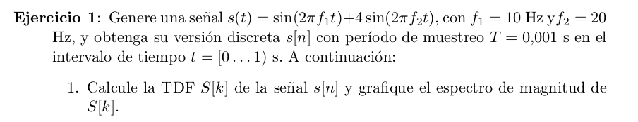

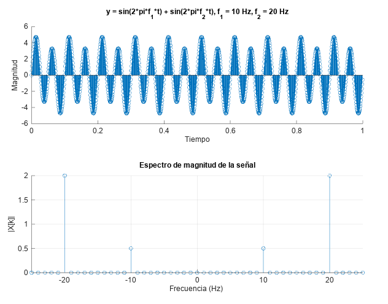

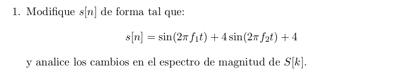

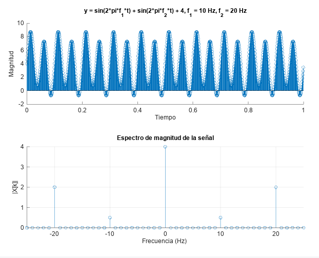

Podemos ver que al sumarle una constante a la señal, esto se ve reflejado en la transformada de Fourier como una componente de magnitud proporcional en la componente $0$ de la misma.

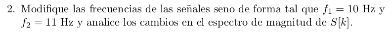

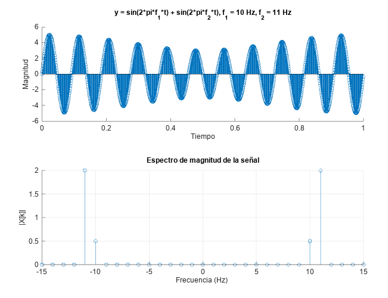

En esta gráfica se siguen teniendo dos 4 componentes en la TDF de la misma magnitud, solo que en este caso la componente que antes aparecía en $20 \, Hz$ ahora aparece en $11 \, Hz$.

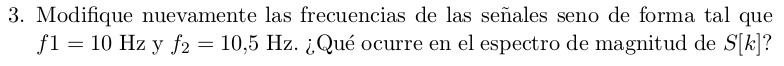

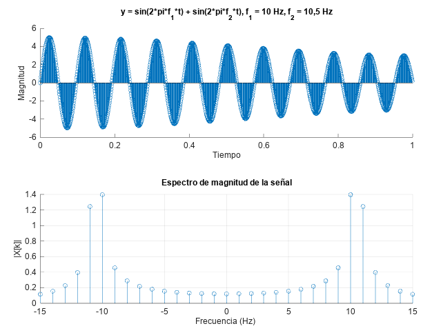

La TDF de esta señal contiene componentes en todas las frecuencias.  
La resolución frecuencial de esta TDF es igual a $\Delta f = f_m / N = 1 Hz$. Ésta no es suficiente para poder discernir correctamente la parte de la señal que es una sinusoidal de $10,5 \,Hz$. Esto ocasiona una aproximación a dicha sinusoide utilizando todos los demás componentes de Fourier, lo que explica la gran cantidad de componentes no nulos.

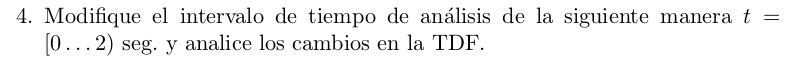

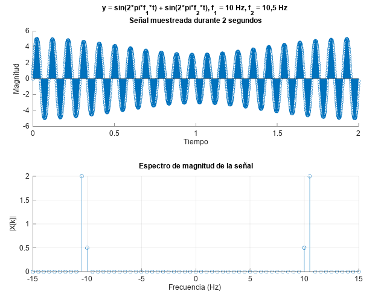

Se está analizando la misma señal que en el caso anterior. La diferencia es que aquí el tiempo de muestreo se amplía a 2 segundos. Esto aumenta la cantidad de muestras y también hace que se modifique la resolución frecuencial: $\Delta f = f_m / N = 0,5 \, Hz$.  
Esto hace posible que la TDF pueda discernir claramente la componente sinusoidal de $10,5 \, Hz$ que posee la señal.

## Ejercicio 5

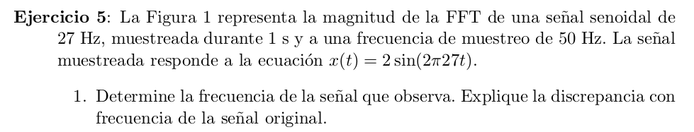

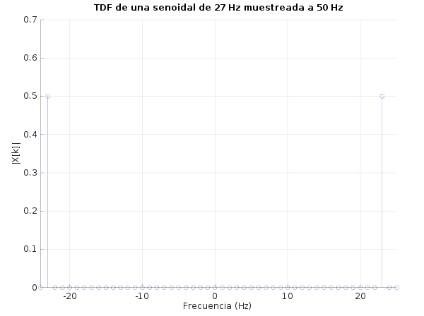

La frecuencia observada en el gràfico es de 23 Hz. La discrepancia observada con la frecuencia real de la señal muestreada es aliasing, provocado por haber utilizado una frecuencia de muestreo menor al doble de la frecuencia de la señal.

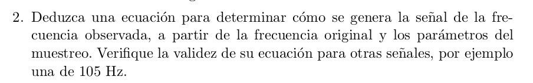

La fórmula para determinar la frecuencia aparente $f_a$ de una senoidal con frecuencia $f_s$ muestreada a frecuencia $f_m$ es:

$$
f_a =
\begin{cases}
\mod(f_m, f_s), & \text{si} \mod(f_m, f_s) \le \frac{f_m}{2} \\
\frac{f_m}{2} - \mod(\frac{f_m}{2}, f_s), & \text{en otro caso}
\end{cases}
$$

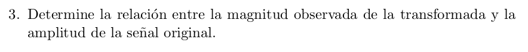

La relación entre la magnitud observada $m_o$ de la transformada y la amplitud de la señal original $A$ es $m_o = \frac{A}{2} N$, donde $N$ es la cantidad de muestras de la señal.

